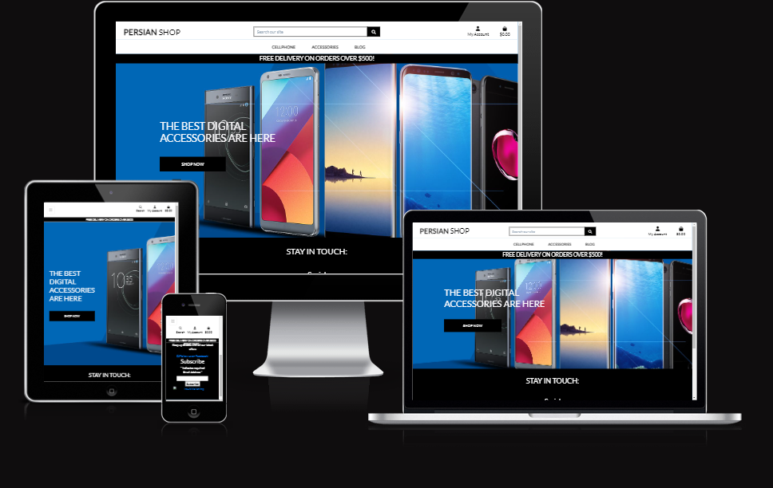

# **persianshop **
persianshop is a small online shop which you can buy cellphones and accessories .
 I have created for Portfolio Project #5 (E-Commerce Applications Portfolio Project) - Diploma in Full Stack Software Development Diploma at the [Code Institute](https://www.codeinstitute.net).

[View live website here](https://persian-shop.onrender.com/)



# Table of Content

* [**Project**](<#project>)
    * [Objective](<#objective>)
    * [Site Users Goal](<#site-users-goal>)
    * [Site Owners Goal](<#site-owners-goal>)
    * [Project Management](<#project-management>)

* [**User Experience (UX)**](<#user-experience-ux>)
    * [User Stories](<#user-stories>)
    * [Site Structure](<#site-structure>)
   
* [**Existing Features**](<#existing-features>)
    * [Top Bar](<#top-bar>)
    * [Navigation](<#navigation>)
    * [Home](<#home>)
    * [Products](<#products>)
    * [Shopping Bag](<#shopping-bag>)
    * [Secure Checkout](<#secure-checkout>)
    * [Order Confirmation](<#order-confirmation>)
    * [Confirmation Emails](<#confirmation-emails>)
    * [Sign Up](<#sign-up>)
    * [Sign In](<#sign-in>)
    * [Sign Out](<#sign-out>)
    

* [**Technologies Used**](<#technologies-used>)
    * [Languages](<#languages>)
    * [Frameworks & Software](<#frameworks--software>)
    * [Libraries](<#libraries>)

* [**Testing**](<#testing>)
    * [Testing User Stories](<#testing-user-stories>)
    * [Code Validation](<#code-validation>)
    * [Additional Testing](<#additional-testing>)
    * [Known Bugs](<#known-bugs>)
* [Deployment](<#deployment>)
* [Credits](<#credits>)
* [Acknowledgements](<#acknowledgements>)

# **Project**

## Objective
I have a small mobile shop in Iran so i decided to create a online shop for my store and at the same time demonstrate my knowledge within the Django Framework, Python, JavaScript, CSS and HTML.

## Site Users Goal
The user of 'persianshop' are the peoples who need a cellphone or want to update the phones or need some accessories for their phones.

## Site Owners Goal
The goal is to introduce the shop in online network.


* **Search Engine Optimization (SEO)**
Search Engine Optimization is a very important method to improve the ranking on search-engines (and has a high Return Of Investment if done right). The ambition is that persianshop includes relevant, professional and reliable content and offers a hassle free experience for the site user. persianshop has an ambition (even thought it's not an easy task) to use keywords in the content that matches the users search criteria when using search engines. Descriptive Meta Tags have been implemented on the site after a brainstorming session (and use of [Wordtracker](https://www.wordtracker.com/)). 
[Back to top](<#table-of-content>)

## Project Management

### Github Board
For this project I have used the application  GitHub to have control over my project. 

[Back to top](<#table-of-content>)

### Database Schema
I have used a modelling tool called [Graph Models](https://django-extensions.readthedocs.io/en/latest/graph_models.html) to create the database schema. In short it shows the relationships between the different models in the database connected to the application. Graph Models exports a *.dot file which easily can be converted to a more 'easy to read' design with the help of the application [dreampuf](https://dreampuf.github.io/GraphvizOnline/).

Models used (besides standard user model) in this project are:


**App: Checkout**
* **Order** - Handles all customer orders. Holds delivery information but also generates i.e. order numbers and update totals. Has a foreign connection to the user_profile model.
* **OrderLineItem** - Keeps track of each order item in each order the customer with ForeignKeys to the Order and Product model.

**App: Products**
* **Category** - Handles product categories.
* **Product** - Handles all products in the database, i.e. price, name, category . 

**App: Profiles**
* **UserProfile** - Keeps track of all information connected to delivery information and order history. Also includes a method to create or update the user profile depending of if it exists or not.


# **User Experience (UX)**


## User Stories
Below the user stories for the project are listed to clarify why particular feature matters. These will then be tested and confirmed in the [Testing](<#testing>) section.


|  | | |
|:-------:|:--------|:--------|
| As a Customer | I want to view a list of products so that I can read more about it and purchase it 
| As a Customer | I want to click on a specific product so that I view its details like price, description and image 
| As a Customer | I want to view the total of my purchases at any time so that I can keep track of my expenses 
| As a Site User | I want to navigate easy on the site through paginated list of products so that I feel comfortable using the site 
| As a Site User | I want to register an account so that I have a personal account and get access to my profile
| As a Site User | I want to have my own user profile so that I can view my personal order history and update my contact / payment information
| As a Site User | I want to log out from the site so that I can feel safe that nobody can access my information 
| As a Customer | I want to sort the list of all products in different ways so that I can identify the best prices and products based on category
| As a Customer | I want to sort a specific category of products so that I can identify the best prices or just sort the products by name. 
| As a Customer | I want to easily get information about what I have searched for and how many results the search generated so that I can see if the product is available.
| As a Customer | I want to easily choose the quantity of a product when purchasing it so that that I ensure I get the correct product 
| As a Customer | I want to easily view the items in my cart to be purchased so that I can see the total cost and all the items I am about to receive  .
| As a Customer | I want to easily adjust the amount of products in my cart so that I can change the cart before checking out 
| As a Customer | I want to give my payment information in an easy way so that the checkout-process is quick and easy
| As a Customer | I want to feel safe and secure when interacting with the site so that I feel comfortable to provide all necessary information needed for purchase 
| As a Customer | I want to view an order confirmation after checkout so that I can secure I have purchased the correct items and everything is ok 
| As a Customer | I want to receive an email confirmation after the checkout process is done so that I can keep the information for future use if needed 
| As a Customer | I want to receive an email confirmation when my order changes so that I get relevant information about my order 


### Site Admin

|  | | |
|:-------:|:--------|:--------|
| As a Site Admin | I want to search, create, update and delete product so that I can manage my product content 
| As a Site Admin | I want to log out from the site so that I can feel safe that nobody can access my information 
| As a Site Admin | I want to access an admin area so that I can get a general understanding of i.e. number of users, number of products

[Back to top](<#table-of-content>)

## Site Structure

The persianshop Site can be used in a *logged in* and *logged out* mode. Depending on the login status different pages are available for the user. When the user is logged out  the pages  *CELLPHONE*, *ACCESSORIES*, *my account (register and login)* are available. When the user is logged in *my profile* and *logout* also is available. If you are logged in as an administrator *manage products* is available as well. Worth mentioning is that the site has a clean, intuitive, and minimalistic design that makes the site visit a nice experience.


[Back to top](<#table-of-content>)


# **Features**
The features of the site are listed below.

## **Existing Features**


### **Navigation**
The navigation bar includes the same basic options for the user (logged in or not logged in). If the user is logged in or logged in as an administrator the sub-menus look different.

**Navigation**
* **CELLPHONE** -their is a list of the cellphones that they can  choose. 
* **ACCESSORIES** - In this dropdown menu they can see all the ACCESSORIES they need.
* **My Account** - Lets the user either **register** or **login**
* **Cart** - Views the total cost of the cart when the user starts adding to it. When the user clicks on it the **bag** template opens up.
* **Search Box** - Lets the user search for products on the page.


### **Home**
The home page contains Shop Now button which shows all the products.


### **Shopping Bag**
When the site user had added products by pressing the **add to bag** button the products are being stored in the shopping bag that can be accessed via the 'cart'-button in the navigation menu. In the shopping bag area the user can update and delete the products they have added and get an understanding about the total cost for the products incl. and excl. delivery cost. From this view the user can either continue to shop or go to the secure checkout page.


### **Secure Checkout**
On the secure checkout page the user fills out a form with delivery details, card details to be able to complete the order. In the form the user has a possibility (if logged in) to save the information to the profile. If not logged in they get an option to register / sign in. On the page there is an order summary as well. If something doesn't look right the user has a possibility to adjust the bag. If the user is happy with the order summary they can use the **complete order** button to send the order for processing. The payment service used in this project is Stripe.


### **Order Confirmation**
If everything goes according to plan and the webhooks between Stripe and the site are OK an order confirmation page will be shown to the user (and a confirmation e-mail will be sent to the users registered e-mail address).


### **Confirmation Email**
When the order is confirmed the user gets an confirmation e-mail to the registered e-mail.


### **Sign Up**
If the site visitor has no registered user at persianshop they can sign up.


### **Sign In**
On this page the user can sign in to persianshop.


### **Sign Out**
When the user clicks sign out in the menu bar a confirmation page is being showed so that the user don't accidently sign out.


[Back to top](<#table-of-content>)

# Technologies Used

## Languages

* [Python](https://en.wikipedia.org/wiki/Python_(programming_language)) - Provides the functionality for the site.
* [HTML5](https://en.wikipedia.org/wiki/HTML) - Provides the content and structure for the website.
* [CSS3](https://en.wikipedia.org/wiki/CSS) - Provides the styling for the website.
* [JavaScript](https://en.wikipedia.org/wiki/JavaScript) - Provides interactive elements of the website

## Frameworks & Software
* [Bootstrap](https://getbootstrap.com/) - A CSS framework that helps building solid, responsive, mobile-first sites
* [Django](https://www.djangoproject.com/) - A model-view-template framework used to create the Review | Alliance site
* [Github](https://github.com/) - Used to host and edit the website.
* [render](https://render.com) - A cloud platform that the application is deployed to.
* [Lighthouse](https://developer.chrome.com/docs/lighthouse/overview/) - Used to test performance of site.
* [Responsive Design Checker](https://www.responsivedesignchecker.com/) - Used for responsiveness check.
* [Favicon](https://favicon.io/) - Used to create the favicon.
* [VSCode](https://code.visualstudio.com/) - Used to create and edit the site.
* [Google Chrome DevTools](https://developer.chrome.com/docs/devtools/) - Used to debug and test responsiveness.
* [Whitenoise](https://whitnoise.com/) - A service that hosts all static files and images in the project.
* [HTML Validation](https://validator.w3.org/) - Used to validate HTML code
* [CSS Validation](https://jigsaw.w3.org/css-validator/) - Used to validate CSS code
* [CI Python Linter](https://pep8ci.herokuapp.com/) - Used to lint the Python code in the project
* [JSHint Validation](https://jshint.com/) - Used to validate JavaScript code

## Libraries

[Back to top](<#table-of-content>)

The libraries used in this project are located in the requirements.txt file and have been documented below

* [asgiref](https://pypi.org/project/asgiref/) - ASGI is a standard for Python asynchronous web apps and servers to communicate with each other, and positioned as an asynchronous successor to WSGI.
* [backports.zoneinfo](https://pypi.org/project/backports.zoneinfo/) - Exposes the backports.zoneinfo module, which is a backport of the zoneinfo module.
* [boto3](https://boto3.amazonaws.com/v1/documentation/api/latest/index.html) - Is used to create, configure, and manage AWS services, such as Amazon Elastic Compute Cloud (Amazon EC2) and Amazon Simple Storage Service (Amazon S3).

* [botocore](https://botocore.amazonaws.com/v1/documentation/api/latest/index.html) - Botocore is a low-level interface to a growing number of Amazon Web Services. Botocore serves as the foundation for the AWS-CLI command line utilities.
* [dj-database-url](https://pypi.org/project/dj-database-url/) - This simple Django utility allows you to utilize the 12factor inspired DATABASE_URL environment variable to configure your Django application.)
* [Django](https://pypi.org/project/Django/) - Django is a high-level Python web framework that encourages rapid development and clean, pragmatic design.
* [django-allauth](https://pypi.org/project/django-allauth/) - Integrated set of Django applications addressing authentication, registration, account management as well as 3rd party (social) account authentication.
* [django-countries](https://pypi.org/project/django-countries/) - A Django application that provides country choices for use with forms, flag icons static files, and a country field for models.)
* [django-crispy-forms](https://pypi.org/project/django-crispy-forms/) - Used to integrate Django DRY forms in the project.
* [django-extensions](https://pypi.org/project/django-extensions/) - Django Extensions is a collection of custom extensions for the Django Framework.
* [django-storages](https://django-storages.readthedocs.io/en/latest/) - django-storages is a collection of custom storage backends for Django.
* [gunicorn](https://pypi.org/project/gunicorn/) - Gunicorn ‘Green Unicorn’ is a Python WSGI HTTP Server for UNIX. It’s a pre-fork worker model ported from Ruby’s Unicorn project. The Gunicorn server is broadly compatible with various web frameworks, simply implemented, light on server resource usage, and fairly speedy.
* [jmespath](https://pypi.org/project/jmespath/) - JMESPath (pronounced “james path”) allows you to declaratively specify how to extract elements from a JSON document.
* [oauthlib](https://pypi.org/project/oauthlib/) - OAuthLib is a framework which implements the logic of OAuth1 or OAuth2 without assuming a specific HTTP request object or web framework.
* [Pillow](https://pypi.org/project/Pillow/) - The Python Imaging Library adds image processing capabilities to your Python interpreter.
* [psycopg2](https://pypi.org/project/psycopg2/) - Psycopg is the most popular PostgreSQL database adapter for the Python programming language.
* [pydot](https://pypi.org/project/pydot/) - is an interface to Graphviz that can parse and dump into the DOT laungage.
* [PyJWT](https://pypi.org/project/PyJWT/) - A Python implementation of RFC 7519.
* [python3-openid](https://pypi.org/project/python3-openid/) - OpenID support for modern servers and consumers.
* [pytz](https://pypi.org/project/pytz/) - This is a set of Python packages to support use of the OpenID decentralized identity system in your application, update to Python 3
* [requests-oauhlib](https://pypi.org/project/requests-oauthlib/) - P    rovides first-class OAuth library support for Requests.
* [s3transfer](https://pypi.org/project/s3transfer/)- S3transfer is a Python library for managing Amazon S3 transfers. This project is maintained and published by Amazon Web Services.
* [sqlparse](https://pypi.org/project/sqlparse/) - sqlparse is a non-validating SQL parser for Python. It provides support for parsing, splitting and formatting SQL statements.
* [stripe](https://pypi.org/project/stripe/) - A Python library for Stripe’s API.

# Testing

## Testing User Stories

### Viewing And Navigation

* As a Customer I want to view a list of products so that I can read more about it and purchase it
 
* As a Customer I want to click on a specific product so that I view its details like price, description and image

* As a Customer I want to view the total of my purchases at any time so that I can keep track of my expenses

* As a Site User I want to navigate easy on the site through paginated list of products so that I feel comfortable using the site

### Registration And User Accounts

* As a Site User I want to register an account so that I have a personal account and get access to my profile
   
* As a Site User I want to have my own user profile so that I can view my personal order history and update my contact / payment information

* As a Site User I want to log out from the site so that I can feel safe that nobody can access my information
 
### Sorting And Searching

* As a Customer I want to sort the list of all products in different ways so that I can identify the best prices and products based on category
    
* As a Customer I want to sort a specific category of products so that I can identify the best prices or just sort the products by name.
    
* As a Customer I want to easily get information about what I have searched for and how many results the search generated so that I can see if the product is available.
    
### Purchasing And Checkout

* As a Customer I want to easily choose the quantity of a product  when purchasing it so that that I ensure I get the correct product
   
* As a Customer I want to easily view the items in my cart to be purchased so that I can see the total cost and all the items I am about to receive
   
* As a Customer I want to easily adjust the amount of products in my cart so that I can change the cart before checking out
   
* As a Customer I want to give my payment information in an easy way so that the checkout-process is quick and easy
   
* As a Customer I want to feel safe and secure when interacting with the site so that I feel comfortable to provide all necessary information needed for purchase
   
* As a Customer I want to view an order confirmation after checkout so that I can secure I have purchased the correct items and everything is ok
    
* As a Customer I want to receive an email confirmation after the checkout process is done so that I can keep the information for future use if needed

### Site Admin

* As a Site Admin I want to search, create, update and delete product posts so that I can manage my product content
   
* As a Site Admin I want to log out from the site so that I can feel safe that nobody can access my information
 
[Back to top](<#table-of-content>)

## Code Validation
The code on the persianshop site has been tested through W3C Markup Validation Service, W3C CSS Validation Service, CI Python Linter and JSHint.

### Markup Validation
 Errors were at first found on the site in the W3C Markup Validation Service but could quite easily be fixed . After fixing the initial errors that W3C Markup Validation Service reported, no errors were returned.


[Back to top](<#table-of-content>)

### CSS Validation
When validating my own code the W3C CSS Validator reports no errors but 16 errors connected to Bootstrap were reported.

### PEP Validation
CI Python Linter [Code Institute Linter](https://pep8ci.herokuapp.com/) was used to validate the Python code in the project. Following files have been validated:

**App Bag**
* admin.py -  No errors reported
* apps.py -  No errors or warnings reported
* contexts.py -  No errors or warnings reported
* urls.py -  No errors or warnings reported
* views.py -  No errors or warnings reported

**App Checkout**
* __init__.py - No errors reported
* admin.py - No errors reported
* apps.py - No errors reported
* forms.py - No errors reported
* models.py - No errors reported
* signals.py - No errors reported
* urls.py - No errors reported
* views.py - No errors reported
* webhook_handler.py -  No errors reported
* webhooks.py -  No errors reported

**App Home**
* apps.py - No errors reported
* urls.py - No errors reported
* views.py - No errors reported

**App Products**
* admin.py - No errors reported
* apps.py - No errors reported
* forms.py - No errors reported
* models.py - No errors reported
* urls.py - No errors reported
* views.py - No errors reported

**App Profiles**
* apps.py - No errors reported
* forms.py - No errors reported
* models.py - No errors reported
* urls.py - No errors reported
* views.py - No errors reported

[Back to top](<#table-of-content>)

### JavaScript Validation
The [JSHint](https://jshint.com/) validator results can be seen below:

No errors were returned when passing through JSHint but the test with no errors.

* stripe_elements.js in checkout app - No errors reported
* inline jscript in bag.html in bag app - No errors reported
* inline jscript in products.html in products app - No errors reported
* inline jscript in base.html in root templates - No errors reported

[Back to top](<#table-of-content>)

## Additional Testing

### Manual Testing

In addition to tests stated above I have performed a series of manual tests.
* I signup a account
* I searched the products 
* I add a product to my bag
* I update the quantity and remove it to see it works fine.
* I tried to remove the product from my bag.
* I add another product to the bad
* I purchase the product 
* I completed my personal info
* I add cart and bought the product

[Back to top](<#table-of-content>)

### Automated Testing
No automated testing has been done during this project.

### Responsiveness Test
The responsive design tests were carried out manually with [Google Chrome DevTools](https://developer.chrome.com/docs/devtools/) and [Responsive Design Checker](https://www.responsivedesignchecker.com/).

| Desktop    | Display <1280px       | Display >1280px    |
|------------|-----------------------|--------------------|
| Render     | pass                  | pass               |
| Images     | pass                  | pass               |
| Links      | pass                  | pass               |

| Tablet     | Samsung Galaxy Tab 10 | Amazon Kindle Fire | iPad Mini | iPad Pro |
|------------|-----------------------|--------------------|-----------|----------|
| Render     | pass                  | pass               | pass      | pass     |
| Images     | pass                  | pass               | pass      | pass     |
| Links      | pass                  | pass               | pass      | pass     |

| Phone      | Galaxy S5/S6/S7       | iPhone 6/7/8       | iPhone 12pro         |
|------------|-----------------------|--------------------|----------------------|
| Render     | pass                  | pass               | pass      | pass     |
| Images     | pass                  | pass               | pass      | pass     |
| Links      | pass                  | pass               | pass      | pass     |

[Back to top](<#table-of-content>)

### Browser Compatibility
* Google Chrome Version (107.0.5304.110)
* Mozilla Firefox (version 107.0)
* Min (version 1.26.0)
* Apple Safari (version 16.0)
* Microsoft Edge (version 107.0.1418.42)

[Back to top](<#table-of-content>)

### Lighthouse
Google Lighthouse in Chrome Developer Tools was used to test the site within the areas of *Performance*, *Accessibility*, *Best Practices* and *SEO*. I tested the *home page*, *view all blog posts page*, *view all products page*, *product management page* and *blog management page*. The testing showed the following:


[Back to top](<#table-of-content>)

### Peer Review
Additional testing of the site was conducted by people outside of the software development field. Some smaller spelling and grammar errors were found on the site and corrected. No major challenges connected to the design or handling of the site.

### Fixed Bugs

*  When trying to log in to the site locally a CSRF verification failed appears. This fail was connected to CSRF Trusted Origins which could be fixed by adding a row to settings.py. It is a little bit of a hassle to change the address from time to time due to that the local address changes.
*  I have problems with thw aws amazon to making the account. so had to change the plan to whitenoise 
*  I got quite a lot of problems when I deployed the site to Heroku . so i decided to change the cloud site render.vom

*  The CSS Validation reported an error that is connected to Bootstrap. When I validate my own CSS code there are no errors at all. So this might be a Font Awesome bug that is out of my control. But I thought it would be proper to highlight the error here in the bugs section.

* The most problems were by the styling the code i had to fix it.
[Back to top](<#table-of-content>)

# Deployment

## Deployment To Render

The project was deployed to [render](https://www.render.com). To deploy, please follow the process described below:

1. Create a GitHub repository from the [Code Institute template](https://github.com/Code-Institute-Org/gitpod-full-template) by following the link and then click 'Use this template'.

2. Fill in the details as stated in the screenshot below and then click 'Create Repository From Template'.

3. When the repository is created i downlodes to vc code to start codding .

4. The next step is installing Django and the supporting libraries that are needed. To do this, type the commands below.

* ```pip3 install 'django<4' gunicorn```
* ```pip3 install 'dj_database_url psycopg2```
* ```pip3 install 'dj3-cloudinary-storage```

5. When you have installed Django and the libraries it's time to create a requirements file.

* ```pip3 freeze --local > requirements.txt``` - This will create and add required libraries to requirements.txt


6. To create the project, write the following command.

* ```django-admin startproject YOUR_PROJECT_NAME .``` - This will create your project

7. When the project is created it's time to create the application.

* ```python3 manage.py startapp APP_NAME``` - This will create your application

8. Add the application to settings.py and first migration

Now it is time to do our first migration and run the server to test that everything works as expected. This is done by writing the commands below.

* ```python3 manage.py migrate``` - This will migrate the changes
* ```python3 manage.py runserver``` - This runs the server. To test it, click the open browser button that will be visible after the command is run.

9. The next step is to create our application on render, attach a database, prepare our environment and settings.py file and setup the whitenoise storage for our static and media files.

10. Now it's time to enter an application name that needs to be unique. When you have chosen the name, choose your region and click 'Create app".


11. Go to the settings tab and click on the reveal Config Vars button. Copy the text from DATABASE_URL (because we are going to need it in the next step).

12. Go back to GitPod and create a new env.py in the top level directory. Then add these rows.

* ```import os``` - This imports the os library
* ```os.environ["DATABASE_URL_FROM HEROKU"]``` - This sets the environment variables.
* ```os.environ["SECRET_KEY"]``` - Here you can choose whatever secret key you want.

13. Now we are going to head back to render to add our secret key to config vars.

14. Now we have some preparations to do connected to our environment and settings.py file. In the settings.py, add the following code:

```import os```

```import dj_database_url```

```if os.path.isfile("env.py"):```

```import env```

15. Now we need to make some changes in the database settings the settings.py file .

16. Save all your fields and migrate the changes.

```python3 manage.py migrate```

17. In this project there are quite a lot of config variables that needs to be setup (i.e. Stripe, e-mail hosts). Some of these settings also needs to be added to the environment. The config variables in this projects are:

* DATABASE_URL
* EMAIL_HOST_PASS
* EMAIL_HOST_USER
* PORT
* SECRET_KEY
* STRIPE_PUBLIC_KEY
* STRIPE_SECRET_KEY
* STRIPE_WH_SECRET

18. It's very important to add the correct installed apps (that also can be found in the requirements file) in the settings file.

19. For Django to be able to understand how to use and where to store static files we need to add some extra rows to the settings.py file. 

20. To be able to get the application to work through Heroku we also need to add our Heroku app and localhost to which hosts that are allowed. You might also need to add a CSRF_TRUSTED_ORIGINS line if you are going to run the project locally.

21. Now you can save all the files and prepare for the first commit and push to Github by writing the lines below.

* ```git add .```
* ```git commit -m "Deployment Commit```
* ```git push```

22. Before moving on to the render deployment we just need to add one more thing in the config vars. We need to add "PORT" in the KEY input field and "8000" in the VALUE field. If we don't add this there might be problems with the deployment.

23. Now it's time for deployment. Scroll to the top of the settings page in render and click the 'Deploy' tab. 

## How To Fork The Repository On GitHub

To make an independent copy of a repository on Github you can fork the GitHub account. You can then be viewed and it is also possible to do changes in the copy without affecting the original repository. To fork the repository, take these steps:

1. After logging in to GitHub, locate the repository. On the top right side of the page there is a 'Fork' button. Click on the button to create a copy of the original repository.

[Back to top](<#table-of-content>)


# Credits

## Content

* All text content written by Mohammadtaghi Nikmaram.

* Product images and text taken from [GsmArena](https://www.gsmarena) .

* Template for read.me provided by Code Institute (*with some additional changes that my mentor [Precious Ijege](https://www.linkedin.com/in/precious-ijege-908a00168/))* suggested.

## Technical

* Some parts of this project are heavily inspired by the 'Building an E-commerce Platform - Project - Boutique Ado' provided by the [Code Institute](https://www.codeinstitute.net) (i.e. webhook_handler, signals and some of the checkout views). I have though incorporated my own design, code and added extra functionality to make this project as original as possible (and to present my knowledge within the scope of the project).

# Acknowledgements
This fictional site was created for Portfolio Project #5 (E-Commerce Applications Portfolio Project) - Diploma in Full Stack Software Development Diploma at the [Code Institute](https://www.codeinstitute.net). I would like to thank my mentor [Precious Ijege](https://www.linkedin.com/in/precious-ijege-908a00168/) for relevant feedback during the project and my fantastic wife for supporting me through all the projects.

[Back to top](<#table-of-content>)